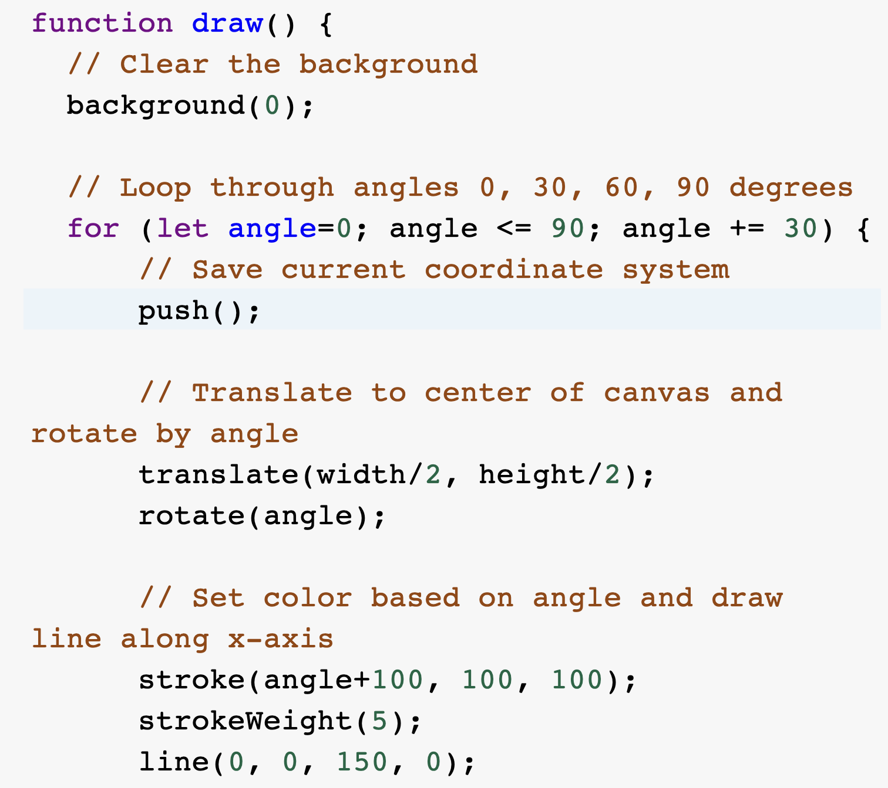

IDEA9103 – Quiz 8

Part 1: Imaging Technique Inspiration – Radial Circular Animation

My inspiration comes from radial circular animation. In this technique, multiple circles are arranged around a central point to form symmetrical and rhythmic visual patterns. I want to incorporate this technique into my major project because it is easy to implement, visually elegant, and highly adaptable. It also offers strong interactive potential, such as responding to sound, time, or user input. This makes it a flexible foundation for creating visually engaging animations in p5.js.

Example Images  
  

Part 2: Coding Technique Exploration – `rotate()` and `translate()` in p5.js

To achieve this radial circle effect, the `rotate()` and `translate()` functions in p5.js are indispensable. By using loops and incrementing the rotation angle, I can place shapes evenly around a central axis. This technique is easy to implement and gives me full control over the pattern's density, size, and animation. In my major project, it serves as a strong foundation for building time-based or interactive visuals.

p5.js Reference: [https://p5js.org/examples/transformation-rotate/](https://p5js.org/examples/transformation-rotate/)

Example Screenshot:
